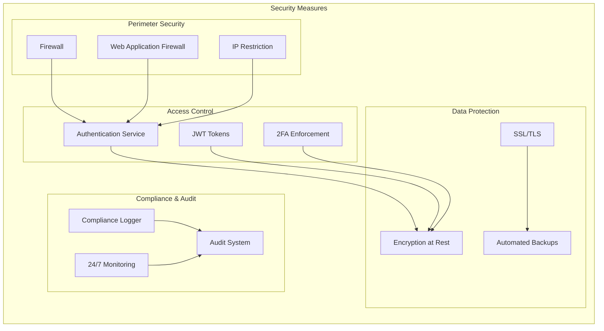

**Security Implementation:**

```mermaid
graph TB
    subgraph "Security Measures"
        direction TB
        
        subgraph "Perimeter Security"
            FW[Firewall]
            WAF[Web Application Firewall]
            IP[IP Restriction]
        end

        subgraph "Access Control"
            Auth[Authentication Service]
            JWT[JWT Tokens]
            2FA[2FA Enforcement]
        end

        subgraph "Data Protection"
            ENC[Encryption at Rest]
            SSL[SSL/TLS]
            BAK[Automated Backups]
        end

        subgraph "Compliance & Audit"
            LOG[Compliance Logger]
            AUD[Audit System]
            MON[24/7 Monitoring]
        end
    end

    FW --> Auth
    Auth --> ENC
    LOG --> AUD
    WAF --> Auth
    IP --> Auth
    JWT --> ENC
    2FA --> ENC
    SSL --> BAK
    MON --> AUD
```